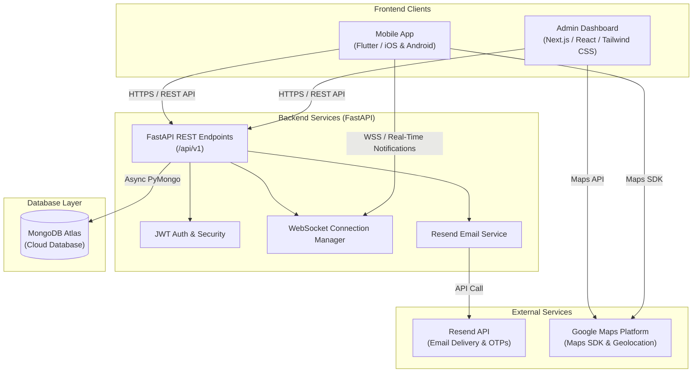

# HallSync

> **Smart Scheduling & Faculty Lecture Hall Management System**  
> Developed for the **Faculty of Computing, Sabaragamuwa University of Sri Lanka**.

---

## Overview

**HallSync** is a unified digital platform designed to modernize and streamline lecture hall allocation, timetable management, and academic scheduling within university faculties. 

In traditional university environments, managing lecture spaces, schedules, and urgent rescheduling often relies on printed timetables, manual spreadsheets, and ad-hoc communication channels. This frequently leads to hall allocation conflicts, room underutilization, last-minute lecture cancellations without timely notice, and confusion for both students and lecturers.

HallSync resolves these operational challenges by offering:
- A **FastAPI REST backend** powered by MongoDB for real-time conflict checking, data persistence, and automated notification triggers.
- A **Next.js Admin Dashboard** for faculty administrators to manage departments, batches, modules, lecture halls, and bulk user onboarding.
- A **Flutter Mobile Application** for students and lecturers to access live schedules, reserve available halls, locate venues on Google Maps, and receive instant updates.

---

## Features

- **Smart Lecture Scheduling & Conflict Detection**: Automated overlapping time-slot verification prevents double bookings for lecture halls across dates and time intervals.
- **Dynamic Hall Status & Availability**: Real-time visibility into whether a hall is currently occupied, what session is taking place, and upcoming scheduled lectures.
- **Interactive Timetable Management**: Departmental and batch-level timetable creation, modification, and live synchronization.
- **Real-Time Push Notifications**: Instant alerts over WebSockets when a lecture is created, updated, or rescheduled for students in the relevant department.
- **Automated User Onboarding & Email Credentials**: Single and bulk CSV/Excel user import with auto-generated secure passwords and instant welcome emails dispatched via **Resend**.
- **Self-Service Authentication & Password Recovery**: Secure JWT authentication, mandatory first-login password updates, and OTP-based email password resets.
- **Campus & Hall Geolocation**: Embedded Google Maps integration allowing students and lecturers to find exact hall coordinates and physical locations.
- **Issue & Feedback Reporting**: Built-in reporting system allowing users to report venue/equipment issues directly to administration.

---

## User Roles

| Role | Interface | Key Capabilities |
| :--- | :--- | :--- |
| **Administrator** | Admin Web Dashboard | • Manage lecture halls (capacity, floor, building, amenities, GPS coordinates)<br>• Manage users (single creation, editing, deletion, and bulk CSV/Excel import)<br>• Configure departments, degree programs, and curriculum modules<br>• Create and modify master faculty timetables<br>• Monitor real-time hall occupancy status |
| **Lecturer** | Mobile Application | • View personal lecture schedules and assigned modules<br>• Create new lecture sessions and reserve available lecture halls<br>• Real-time hall conflict verification prior to booking<br>• Reschedule or cancel existing lecture slots<br>• View hall availability, amenities, and campus map location |
| **Student** | Mobile Application | • View customized daily and weekly departmental timetables<br>• Receive real-time WebSocket notifications when lectures are scheduled/rescheduled<br>• Check hall details, equipment, and occupancy status<br>• Navigate to lecture halls using embedded Google Maps<br>• Submit bug reports and facility feedback to faculty administrators |

---

## System Architecture

HallSync follows a decoupled client-server architecture:



---

## Tech Stack

### Backend
- **Framework**: [FastAPI](https://fastapi.tiangolo.com/) (Python 3.9+)
- **Database Driver**: [PyMongo](https://pymongo.readthedocs.io/) (Asynchronous MongoDB Client)
- **Data Validation & Schemas**: [Pydantic v2](https://docs.pydantic.dev/) & `pydantic-settings`
- **Security & Authentication**: [PyJWT](https://pyjwt.readthedocs.io/), [Passlib](https://passlib.readthedocs.io/) with `bcrypt`
- **Email Delivery**: [Resend Python SDK](https://resend.com/)
- **Real-Time Communication**: FastAPI WebSockets

### Admin Dashboard
- **Framework**: [Next.js 16](https://nextjs.org/) (App Router) & [React 19](https://react.dev/)
- **Styling**: [Tailwind CSS v4](https://tailwindcss.com/)
- **Icons & UI Utilities**: [Lucide React](https://lucide.dev/), `@lottiefiles/dotlottie-react`, `ldrs`
- **Data Import**: [XLSX (SheetJS)](https://sheetjs.com/) for spreadsheet parsing
- **Analytics**: `@vercel/speed-insights`

### Mobile Application
- **Framework**: [Flutter](https://flutter.dev/) (Dart SDK 3.x)
- **Map & Location**: `google_maps_flutter`
- **Calendar & Schedule**: `syncfusion_flutter_calendar`
- **Secure Storage**: `flutter_secure_storage` & `shared_preferences`
- **Networking & WebSockets**: `http`, `web_socket_channel`, `jwt_decoder`
- **Environment Management**: `flutter_dotenv`

### Database
- **Database**: [MongoDB Atlas](https://www.mongodb.com/atlas) (NoSQL Document Store)

---

## Project Structure

```text
Hallsync/
├── backend/
│   ├── app/
│   │   ├── api/
│   │   │   ├── routes/              # Route controllers (auth, users, halls, lectures, etc.)
│   │   │   └── api.py               # Central APIRouter aggregation
│   │   ├── core/                    # App configuration, security, DB connections & WebSocket manager
│   │   ├── dependencies/            # FastAPI dependency injection helpers
│   │   ├── models/                  # Internal data representations
│   │   ├── repositories/            # Database query abstractions (User, Hall, Timetable, Module, etc.)
│   │   ├── schemas/                 # Pydantic request/response validation models
│   │   ├── services/                # Business logic layer (Email, Hall, User, Notification, etc.)
│   │   └── main.py                  # FastAPI application entry point & CORS configuration
│   ├── tests/                       # Unit and integration test suites
│   ├── requirements.txt             # Python dependencies
│   ├── seed_admin.py                # Admin user database seeder script
│   └── check_db.py                  # Database connection verification utility
├── frontend/
│   ├── admin_dashboard/
│   │   ├── app/                     # Next.js App Router pages (login, dashboard, users, halls, timetables)
│   │   ├── controllers/             # Frontend controllers handling user actions and state
│   │   ├── models/                  # UI data models
│   │   ├── services/                # API Client and HTTP service wrappers
│   │   ├── views/                   # React view components, modals, and layouts
│   │   └── package.json             # Dashboard dependencies & scripts
│   └── mobile_app/
│       ├── lib/
│       │   ├── constants/           # App colors and static dataset definitions
│       │   ├── features/auth/       # Login, password change, and OTP reset screens
│       │   ├── models/              # Dart data models (Hall, Lecture, Notification, Report)
│       │   ├── screens/             # Student/Lecturer dashboards, hall details, maps, reports
│       │   ├── services/            # API integration, secure storage, and WebSocket services
│       │   ├── widgets/             # Reusable UI cards, navigation bars, and headers
│       │   └── main.dart            # Flutter application entry point & route definitions
│       └── pubspec.yaml             # Flutter packages and asset configurations
└── readme.md                        # Master project documentation
```

---

## Prerequisites

Before running the project locally, ensure you have installed:

- **Python**: Version `3.9` or higher
- **Node.js**: Version `18.x` or `20.x` & `npm`
- **Flutter SDK**: Version `3.11.x` or newer & **Dart SDK**
- **Android Studio** / **Xcode** (for running mobile emulators or physical devices)
- **MongoDB Atlas Account** (or a local MongoDB instance `v6.0+`)
- **Resend API Key** (for transactional emails & OTP verification)
- **Google Maps API Key** (with Maps SDK for Android/iOS and Maps JavaScript API enabled)

---

## Installation

### 1. Backend

```bash
# Navigate to the backend directory
cd backend

# Create a virtual environment
python -m venv .venv

# Activate the virtual environment
# On Windows (PowerShell):
.venv\Scripts\Activate.ps1
# On Linux/macOS:
# source .venv/bin/activate

# Install dependencies
pip install -r requirements.txt

# Create your .env file (see Environment Variables section below)
cp .env.example .env   # or create .env manually

# (Optional) Seed the initial admin account
python seed_admin.py
```

### 2. Admin Dashboard

```bash
# Navigate to the admin dashboard directory
cd frontend/admin_dashboard

# Install Node modules
npm install

# Create your local environment file
cp .env.example .env.local   # or create .env.local manually
```

### 3. Mobile App

```bash
# Navigate to the mobile app directory
cd frontend/mobile_app

# Fetch Flutter dependencies
flutter pub get

# Create the mobile app .env file
cp .env.example .env   # or create .env manually
```

---

## Environment Variables

> [!CAUTION]
> Never commit real `.env` files or API secrets into version control. Use the sample formats below with placeholder values.

### Backend (`backend/.env`)

```ini
# MongoDB Connection URI
MONGODB_URL=mongodb+srv://<db_user>:<db_password>@<cluster-address>.mongodb.net/?appName=HallSyncCluster

# Database and Collection Names (Optional overrides)
DATABASE_NAME=hallsync
USER_COLLECTION=users
HALL_COLLECTION=halls

# JWT Authentication Config
JWT_SECRET_KEY=your_secure_random_jwt_secret_key_here
JWT_ALGORITHM=HS256
JWT_EXPIRE_MINUTES=60

# Resend API Key for Transactional Emails & Password Reset OTPs
RESEND_API_KEY=re_123456789_abcdefghijklmnopqrstuvwxyz
```

### Admin Dashboard (`frontend/admin_dashboard/.env.local`)

```ini
# Google Maps JavaScript API Key
NEXT_PUBLIC_GOOGLE_MAPS_API_KEY=AIzaSyYourGoogleMapsApiKeyPlaceholder

# Backend REST API Base URL
NEXT_PUBLIC_API_BASE_URL=http://localhost:8000/api
```

### Mobile App (`frontend/mobile_app/.env`)

```ini
# Google Maps SDK API Key
GOOGLE_MAPS_API_KEY=AIzaSyYourGoogleMapsApiKeyPlaceholder
```

> **Note for Android Emulators**: In `frontend/mobile_app/lib/services/auth_service.dart`, the backend base URL defaults to `http://10.0.2.2:8000` to allow the Android emulator to access `localhost`. For real devices, update this to your local machine's LAN IP or production URL.

---

## API Documentation

When the backend server is running locally, interactive API documentation is automatically accessible at:
- **Swagger UI**: [http://localhost:8000/docs](http://localhost:8000/docs)
- **ReDoc**: [http://localhost:8000/redoc](http://localhost:8000/redoc)

### Base URL
- **Local**: `http://localhost:8000/api`
- **Production**: `https://<deployed-domain>/api`

### Main API Endpoints

#### Authentication & Account Management (`/api/auth`)
| Method | Endpoint | Description | Auth Required |
| :--- | :--- | :--- | :--- |
| `POST` | `/api/auth/login` | Authenticate user credentials and receive JWT access token | No |
| `POST` | `/api/auth/change-password` | Update user password (initial login or standard change) | No |
| `POST` | `/api/auth/forgot-password` | Send a one-time password (OTP) to user's registered email | No |
| `POST` | `/api/auth/verify-otp` | Verify the OTP code sent via email | No |
| `POST` | `/api/auth/reset-password` | Reset password using verified OTP token | No |

#### Admin Authentication (`/api/admin`)
| Method | Endpoint | Description | Auth Required |
| :--- | :--- | :--- | :--- |
| `POST` | `/api/admin/login` | Authenticate admin portal credentials and receive admin JWT | No |
| `GET` | `/api/admin/verify-token` | Validate active admin JWT token from headers | Yes (Bearer) |

#### Users (`/api/users`)
| Method | Endpoint | Description | Auth Required |
| :--- | :--- | :--- | :--- |
| `GET` | `/api/users/` | List all registered users (students, lecturers, admins) | No |
| `POST` | `/api/users/` | Create a new single user record and dispatch welcome email | No |
| `POST` | `/api/users/bulk` | Bulk import users via JSON payload and dispatch batch emails | No |
| `GET` | `/api/users/{university_id}` | Retrieve details for a specific user ID | No |
| `PUT` | `/api/users/{university_id}` | Update existing user record | No |
| `DELETE`| `/api/users/{university_id}` | Remove a user from the system | No |

#### Lecture Halls (`/api/halls`)
| Method | Endpoint | Description | Auth Required |
| :--- | :--- | :--- | :--- |
| `GET` | `/api/halls/` | Fetch halls with dynamic status and optional query filters | No |
| `GET` | `/api/halls/with-status` | Fetch all halls with live occupancy calculation | No |
| `GET` | `/api/halls/{hall_id}/schedule`| Retrieve complete lecture schedule for a specific hall | No |
| `POST` | `/api/halls/` | Create a new lecture hall profile | No |
| `GET` | `/api/halls/{hall_id}` | Retrieve individual hall specifications | No |
| `PUT` | `/api/halls/{hall_id}` | Update hall details (capacity, amenities, GPS, etc.) | No |
| `DELETE`| `/api/halls/{hall_id}` | Delete a hall record | No |

#### Lectures & Timetables (`/api/lectures` & `/api/timetables`)
| Method | Endpoint | Description | Auth Required |
| :--- | :--- | :--- | :--- |
| `GET` | `/api/lectures` | Query lectures by `lecturer_id`, `department`, or `batch` | No |
| `POST` | `/api/lectures` | Create lecture & dispatch real-time WebSocket notifications | No |
| `POST` | `/api/lectures/check-availability` | Check if a hall is free during specified start/end times | No |
| `PUT` | `/api/lectures/{lecture_id}` | Update or reschedule an existing lecture slot | No |
| `DELETE`| `/api/lectures/{lecture_id}` | Cancel/delete a scheduled lecture | No |
| `GET` | `/api/timetables/` | Get list of master timetables | No |
| `POST` | `/api/timetables/` | Create a new faculty timetable | No |
| `GET` | `/api/timetables/{id}` | Retrieve timetable by ID | No |
| `PUT` | `/api/timetables/{id}` | Update timetable slots and lecture entries | No |
| `DELETE`| `/api/timetables/{id}` | Delete a timetable | No |

#### Departments & Modules (`/api/departments` & `/api/modules`)
| Method | Endpoint | Description | Auth Required |
| :--- | :--- | :--- | :--- |
| `GET` | `/api/departments/` | Retrieve all academic departments and course structures | No |
| `GET` | `/api/departments/{code}` | Retrieve department details by department code | No |
| `GET` | `/api/modules` | Fetch all semester module curriculums | No |
| `POST` | `/api/modules/` | Create semester module mapping | No |
| `POST` | `/api/modules/{semester}/items` | Add a single module code/name to a semester | No |
| `DELETE`| `/api/modules/{semester}/items/{module_id}` | Remove a module from a semester | No |

#### Notifications & Reports (`/api/notifications`, `/api/reports`, `/api/ws`)
| Method | Endpoint | Description | Auth Required |
| :--- | :--- | :--- | :--- |
| `GET` | `/api/notifications/{user_id}` | Fetch recent notifications for a user | No |
| `PUT` | `/api/notifications/{id}/read` | Mark a notification item as read | No |
| `POST` | `/api/reports` | Submit an issue or feedback report | No |
| `WS` | `/api/ws/notifications/{email}` | WebSocket stream for live real-time notifications | No |

---

## Database

HallSync utilizes **MongoDB** as a document-based data store. The database schema consists of the following key collections:

- **`users`**: Contains user profiles (`universityId`, `name`, `email`, `department`, `faculty`, `role`, `academicYear`, `modules`, `password_hash`, `isFirstLogin`). Indexed uniquely by `universityId`.
- **`admin`**: Stores administrative credentials and hashed passwords.
- **`halls`**: Stores lecture hall configurations (`hallId`, `name`, `capacity`, `availability`, `building`, `floor`, `amenities`, `latitude`, `longitude`). Indexed uniquely by `hallId`.
- **`lectures`**: Records active, scheduled, and past lecture instances (`title`, `lecturer_id`, `hall_id`, `start_time`, `end_time`, `department`, `batch`, `capacity`).
- **`timetables`**: Stores master timetable templates structured by department, year, and recurring lecture blocks.
- **`modules`**: Stores semester-wise course modules (`semester`, list of `module_id` and `name`). Indexed uniquely by `semester`.
- **`departments`**: Stores faculty departments, degree programs, and curriculum subject catalogs.
- **`notifications`**: Stores alert documents (`recipient_user_id`, `title`, `message`, `related_lecture_id`, `is_read`, `created_at`).
- **`reports`**: Stores feedback, issue, and facility defect tickets (`title`, `description`, `type`, `user_id`, `created_at`).

---

## Running the Project

Follow these steps to run all components locally:

### Step 1: Start the Backend Server
```bash
cd backend
.venv\Scripts\activate      # On Windows
# source .venv/bin/activate # On Linux/macOS
fastapi dev app/main.py
```
*The API server will start on `http://localhost:8000`.*

### Step 2: Start the Admin Dashboard
```bash
cd frontend/admin_dashboard
npm run dev
```
*The Admin Dashboard will start on `http://localhost:3000`.*

### Step 3: Launch the Mobile Application
Make sure you have an Android emulator, iOS simulator, or physical test device connected:
```bash
cd frontend/mobile_app
flutter run
```

---

## Deployment

| Component | Platform / Service | Status | Configuration / Notes |
| :--- | :--- | :--- | :--- |
| **Backend API** | [Railway](https://railway.app/) | Deployed | Production API URL: `https://hallsync-production.up.railway.app` |
| **Admin Dashboard** | [Vercel](https://vercel.com/) | Deployed | Configured with Next.js App Router and `@vercel/speed-insights` |
| **Database** | [MongoDB Atlas](https://www.mongodb.com/atlas) | Deployed | Fully managed cloud cluster with TLS/SSL encryption |
| **Email Service** | [Resend](https://resend.com/) | Active | Handles transactional welcome emails & password reset OTPs |
| **Mobile App** | Google Play / App Store | Not currently deployed | Distributed via local APK / direct Flutter builds |

---

## Screenshots

<!-- Add screenshots of the Mobile App and Admin Dashboard below -->

### Mobile Application
*Placeholder for mobile app screens (Student Dashboard, Lecturer Hall Booking, Timetable View, and Campus Map Navigation).*

### Admin Dashboard
*Placeholder for admin dashboard screens (Hall Management, Timetable Planner, User Management & Bulk Import).*

---

## Future Improvements

- **Intelligent Hall Allocation & Timetable Generation**: Implementing optimization algorithms to auto-generate conflict-free timetables.
- **Mobile Push Notifications (FCM / APNs)**: Integrating Firebase Cloud Messaging to ensure background push notifications when the mobile app is closed.
- **Offline Mode & Caching**: Local SQLite/Hive storage in the mobile app for accessing timetables without an active internet connection.

---

## Contributors

Developed by undergraduate students for the **Faculty of Computing, Sabaragamuwa University of Sri Lanka**:

- **Sahan Lochana** ([@SahanLochana](https://github.com/SahanLochana))
- **Saruhasan** ([@Saruhasan](https://github.com/Saruhasan))
- **Ashvinindi Uthkarsha** ([@Ashvinindi](https://github.com/Ashvinindi))
- **Anne Suwetha** ([@Anne-Suwetha](https://github.com/Anne-Suwetha))
- **Athithan** ([@athiethan58-code](https://github.com/athiethan58-code))

---